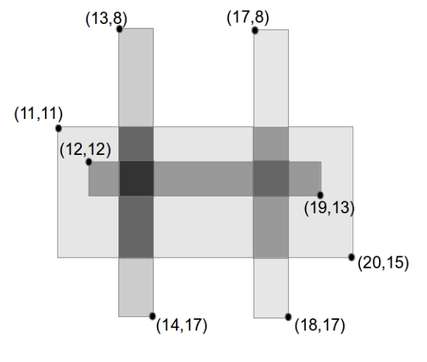

# Tinted Glass Window

***Problem Description***

You are laying *N* rectangular pieces of grey-tinted glass to make a stained glass window. Each
piece of glass adds an integer value “tint-factor”. Where two pieces of glass overlap, the tint-factor
is the sum of their tint-factors.

You know the desired position for each piece of glass and these pieces of glass are placed such
that the sides of each rectangle are parallel to either the x-axis or the y-axis (that is, there are no
“diagonal” pieces of glass).

You would like to know the total area of the finished stained glass window with a tint-factor of at
least *T*.

***Input Specification***

The first line of input is the integer *N* (1 ≤ *N* ≤ 1000), the number of pieces of glass. The second
line of input is the integer *T* (1 ≤ *T* ≤ 1 000 000 000), the threshold for the tint-factor. Each of the
next N lines contain five integers, representing the position of the top-left and bottom-right corners
of the ith piece of tinted glass followed by the tint-factor of that piece of glass. Specifically, the
integers are placed in the order *x<sub>l</sub>* *y<sub>t</sub>* *x<sub>r</sub>* *y<sub>b</sub>* *t<sub>i</sub>*, where the top-left corner is at *(x<sub>l</sub>, y<sub>t</sub>)* and the bottomright corner is at *(x<sub>r</sub>, y<sub>b</sub>)*, and tint-factor is *t<sub>i</sub>*. You can assume that 1 ≤ *t<sub>i</sub>* ≤ 1 000 000. The top-most, left-most co-ordinate where glass can be placed is *(0, 0)* and you may assume 0 ≤ *x<sub>l</sub>* < *x<sub>r</sub>* ≤ *K* and 0 < *y<sub>t</sub>* < *y<sub>b</sub>* ≤ *K*, and

The following additional constraints will apply.
* At least 10% of the marks will be for test cases where *N* ≤ 100 and *K* ≤ 100;
* at least 30% of the marks will be for test cases where *N* ≤ 1000 and *K* ≤ 1000;
* at least 40% of the marks will be for test cases where *N* ≤ 100 and *K* ≤ 1 000 000 000;
* the remaining marks will be for test cases where *N* ≤ 1000 and *K* ≤ 1 000 000 000.
  

***Output Specification***

Output the total area of the finished stained glass window which has a tint-factor of at least *T*. All
output will be less than *2<sup>64</sup>*, and the output for some test cases will be larger than *2<sup>32</sup>*


**Sample Input**

```
4
3
11 11 20 15 1
13 8 14 17 2
17 8 18 17 1
12 12 19 13 1
```

**Output for Sample Input**

5

**Explanation of Output for Sample Input**

There are 4 pieces of glass used. There are two regions of glass which have a tint-factor greater
than or equal to 3: one region between (13, 11) and (14, 15) (which has tint-factor of 3, except for
a unit square with tint-factor 4), and another region between (17, 12) and (18, 13) (with tint-factor
3). In total, these two regions have 5 square units of glass with tint-factor greater than or equal to
3, as shown on the diagram below.


