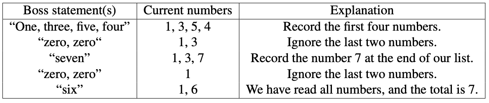

# Zero That Out

**Problem Description**

Your boss has asked you to add up a sequence of positive numbers to determine how much money
your company made last year.

Unfortunately, your boss reads out numbers incorrectly from time to time.
Fortunately, your boss realizes when an incorrect number is read and says “zero”, meaning “ignore
the current last number.”

Unfortunately, your boss can make repeated mistakes, and says “zero” for each mistake.
For example, your boss may say “One, three, five, four, zero, zero, seven, zero, zero, six”, which
means the total is 7 as explained in the following chart:



At any point, your boss will have said at least as many positive numbers as “zero” statements. If
all positive numbers have been ignored, the sum is zero.

Write a program that reads the sequence of boss statements and computes the correct sum.


**Input Specification**

The first line of input contains the integer K (1 ≤ K ≤ 100 000) which is the number of integers
(including “zero”) your boss will say. On each of the next K lines, there will either be one integer
between 1 and 100 (inclusive), or the integer 0.

**Output Specification**

The output is one line, containing the integer which is the correct sum of the integers read, taking
the “zero” statements into consideration. You can assume that the output will be an integer in the
range 0 and 1 000 000 (inclusive).

**Sample Input 1**
```
4
3
0
4
0
```

**Output for Sample Input 1**
```
0
```

**Sample Input 2**

```
10
1
3
5
4
0
0
7
0
0
6
```

***Output for Sample Input 2***

```
7
```