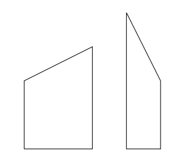
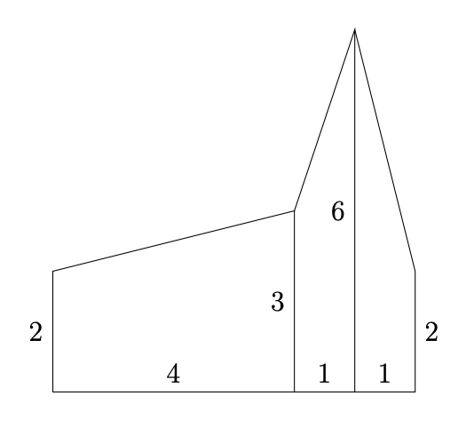
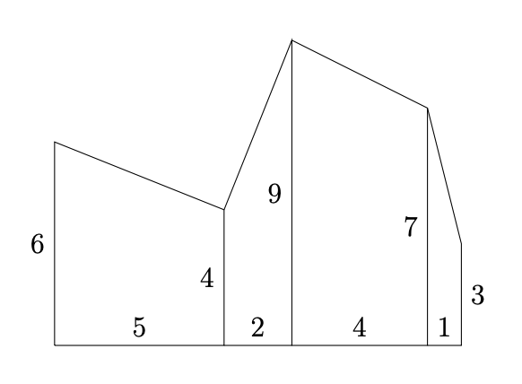

# Crazy Fencing

**Problem Description**

You need to paint a wooden fence between your house and your neighbour’s house. You
want to determine the area of the fence, in order to determine how much paint you will use.
However, the fence is made out of N non-uniform pieces of wood, and your neighbour believes
that they have an artistic flair. In particular, the pieces of wood may be of various widths.
The bottom of each piece of wood will be horizontal, both sides will be vertical, but its top
may be cut on an angle. Two such pieces of wood are shown below:



Thankfully, the fence has been constructed so that adjacent pieces of wood have the same
height on the sides where they touch, which makes the fence more visually appealing.


**Input Specification**

The first line of the input will be a positive integer N, where N ≤ 10 000


The second line of input will contain N + 1 space-separated integers h<sub>1</sub>, . . . , h<sub>N+1</sub> (1 ≤ h<sub>i</sub> ≤100, 1 ≤ i ≤ N + 1) describing the left and right heights of each piece of wood. Specifically,
the left height of the ith piece of wood is h<sub>i</sub> and the right height of the i th piece of wood is
h<sub>i+1</sub>

The third line of input will contain N space-separated integers wi (1 ≤ wi ≤ 100, 1 ≤ i ≤ N)
describing the width of the i
th piece of wood.

**Output Specification**

Output the total area of the fence.

**Sample Input 1**
```
3
2 3 6 2
4 1 1
```

**Output for Sample Input 1**
```
18.5
```

**Explanation of Output for Sample Input 1**
The fence looks like the following:



When looking from left to right, the individual areas of the pieces of wood are 10 = 4·(2+3)/2,
4.5 = 1 · (3 + 6)/2, and 4 = 1 · (6 + 2)/2, for a total area of 18.5.

**Sample Input 2**

```
4
6 4 9 7 3
5 2 4 1
```

**Output for Sample Input 2**
```
75
```
**Explanation of Output for Sample Input 1**

The fence looks like the following:



When looking from left to right, the individual areas of the pieces of wood are 25, 13, 32,
and 5, for a total area of 75.