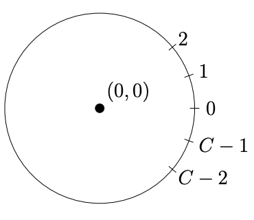
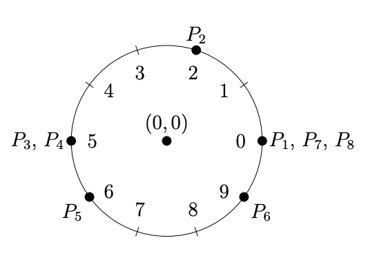

#  Good Triplets

https://www.cemc.uwaterloo.ca/contests/computing/past_ccc_contests/2022/ccc/seniorEF.pdf


**Problem Description**

Andrew is a very curious student who drew a circle with the center at (0, 0) and an integer
circumference of C ≥ 3. The location of a point on the circle is the counter-clockwise arc
length from the right-most point of the circle.



Andrew drew N ≥ 3 points at integer locations. In particular, the ith point is drawn at
location P<sub>i</sub> (0 ≤ P<sub>i</sub> ≤ C − 1). It is possible for Andrew to draw multiple points at the same
location.
A good triplet is defined as a triplet (a, b, c) that satisfies the following conditions:
- 1 ≤ a < b < c ≤ N.
- The origin (0, 0) lies strictly inside the triangle with vertices at P<sub>a</sub>, P<sub>b</sub>, and P<sub>c</sub>. In
particular, the origin is not on the triangle’s perimeter.

Lastly, two triplets (a, b, c) and (a', b', c') are distinct if a ≠ a', b ≠ b', or c ≠ c'.

Andrew, being a curious student, wants to know the number of distinct good triplets. Please
help him determine this number.

**Input Specification**

The first line contains the integers N and C, separated by one space.
The second line contains N space-separated integers. The i
th integer is P<sub>i</sub> (0 ≤ P<sub>i</sub> ≤ C − 1).

The following table shows how the available 15 marks are distributed.

**Output Specification**

Output the number of distinct good triplets.


**Sample Input**
```
8 10
0 2 5 5 6 9 0 0
```
**Output for Sample Input**

```
6
```
**Explanation of Output for Sample Input**

Andrew drew the following diagram


The origin lies strictly inside the triangle with vertices P<sub>1</sub>, P<sub>2</sub>, and P<sub>5</sub>, so (1, 2, 5) is a good triplet. 

The other five good triplets are (2, 3, 6), (2, 4, 6), (2, 5, 6), (2, 5, 7), and (2, 5, 8).
